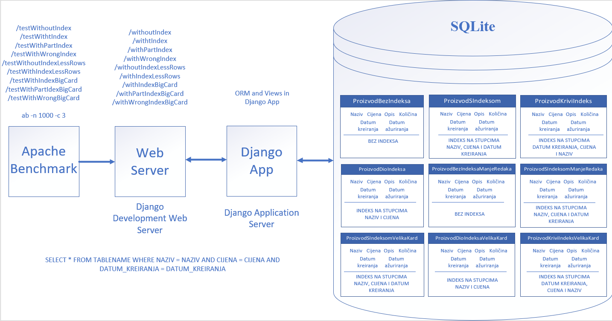

# Benchmark report - Teo Matijašić

---

## Sažetak testiranog koncepta

---

U ovom benchmarku je testiran koncept konkateniranog (složenog indeksa). To je indeks na tablici u bazi podataka koji uključuje više od jednoga stupca te služi za brže pretraživanje podataka. Time, umjesto da se kreira na jednome stupcu kao i obični indeks, konkatenirani indeks se kreira na više stupaca tablice. Time, ako bi imali tablicu sa stupcima prezime i ime te ako bi često postavljali upite koji uključuju filtriranje po tim stupcima konkatenirani indeks s tim stupcima može poboljšati efikasnost upita. Sami stupci se mogu pojaviti u bilo kojem poretku unutar indeksa, ali da bi se postigla veća efikasnost upiti moraju referencirati sve ili vodeći dio stupaca. Tako bi konkatenirani indeks s stupcima (prezime, ime) mogao efikasno pronaći rezultat upita s određenim prezimenom ili s prezimenom i imenom, ali ne i samo s imenom. Općenito pravilo je da se u konkatenirani indeks prvo stavljaju stupci kojima se najčešće pristupa.

### Kako i Zašto poboljšava sustav?

* kao i običan indeks, konkatenirani indeks služi za brzi pronalazak podataka
* poboljšava sustav jer prvenstveno služi za optimizaciju upita koji uključuju više stupaca
* zbog pohrane kombinacije stupaca, potrebno je manje čitanja na disk od traženja po cijeloj tablici

### Potencijalni problemi s konkateniranim indeksom uključuju:
* veliku ovisnost o prisutnosti određenih stupaca pa odbacivanje određenih stupaca u upitu mogu dovesti do smanjena efikasnosti
* može dovesti do opterećenja održavanja ako uključuje puno stupaca
* dovodi do sporijeg ažuriranja podataka zbog toga što se i on sam treba ažurirati kada se ovisni podaci promijene.
* 
Konkatenirani indeks može pridonijeti u različitim vrstama aplikacija i slučajevima korištenja. <br>
### Neki od primjera korištenja:
* kada želimo raditi pretragu po više stupaca, na primjer u online trgovinama kada želimo filtrirati proizvode po kategoriji i cijeni.
* aplikacije za praćenje transakcija gdje možemo sortirati transakcije po datumu, količini i sl.
* aplikacije za rezervacije, pronalazak dostupnih soba/stolova prema datumu, lokaciji
* geoprostorni podaci, upiti koji uključuji i zemljopisnu širinu i dužinu

## Arhitektura sustava

---



Sam sustav sam implementirao kroz Django web aplikaciju. Kada stvorimo django web aplikaciju s naredbom:
```
django-admin startproject mysite
```
automatski s njom dolazi ugrađeni development web server te SQLite implementacija baze podataka. Unutar baze podataka, pomoću modela sam kreirao četiri tablice (ProizvodBezIndeksa, ProizvodSIndeksom, ProizvodDioIndeksa i ProizvodKriviIndeks) koje su predstavljale četiri iste tablice s isto definiranim stupcima. Jedina razlika je ta što sam kreirao različite vrste indeksa nad njima. Time prva tablica nije imala indeks, druga je imala indeks nad stupcima naziv, cijena i datum kreiranja, treća je imala indeks nad stupcima naziv i cijena dok je zadnja imala indeks nad okrenutim redoslijedom stupaca (datum kreiranja, cijena, naziv).
Same testove sam provodio slanjem ab testova na odgovarajuće URL-ove koji su pokretali određene poglede (views) u kojima sam implementirao da pokreću ab naredbu i ispišu njen rezultat. 
Ti ab testovi su zapravo bili slani na URL koji su pokretali nove poglede unutar Django web aplikacije koji su bili zaduženi za postavljanje upita nad odgovarajućom tablicom unutar baze podataka. Time, ako je URL sadržavao /withoutIndex, upit se postavljao na tablicu ProizvodBezIndeksa, ako je sadržavao /withIndeks na tablicu ProizvodSIndeksom itd.  

Web Server unutar Django web aplikacije ne komunicira direktno s bazom podataka jer on služi samo za vraćanje statičnih odgovora pa je time GET upit na određeni URL prvo došao do web servera (Django development server) koji ga je onda proslijedio do aplikacijskog servera ili same Django aplikacije gdje su se onda pregledavali URL-ovi, pozivali određeni pogledi i prevodili modeli u tablice baze podataka (ORM). 
Upiti na svaku tablicu su izgledali jednako te je njihov generalni pseudokod prikazan na vrhu slike. Kod slanja određenih URL-ova, osim odgovarajuće putanje, dodani su i parametri sa znakom upitnika koji su bili odvojeni znakom & te su oni predstavljali vrijednosti stupaca (/?naziv=name&cijena=price&datum_kreiranja=date). 

### Simulacija podataka 

Same podatke sam simulirao pomoću factory-boy-a i Faker-a koji služe za kreiranje lažnih podataka. U svaku tablicu sam kreirao točno 100000 podataka kako bi svaka tablica bila jednaka. Kako sam kreirao indekse nad stupcima naziv, cijena i datum_kreiranja upite sam provodio nad njima. Kako bi testirao performanse indeksa na različitoj kardinalnosti vrijednosti atributa naziva i cijene kreirao sam dvije vrste naziva i cijene. U običnom nazivu sam za naziv i cijenu koristio samo tri moguće vrijednosti kako bi bolje prikazao performanse djelomičnog indeksa koji je sadržavao samo stupce naziv i cijena. U naziv_random i cijena_random sam generirao potpuno različite podatke s Fakerom.

```
class ProizvodFactory(DjangoModelFactory):
    class Meta:
        abstract = True
    
    naziv = factory.Iterator(["bread", "eggs", "milk"])
    naziv_random = factory.Faker("word")
    opis = factory.Faker("sentence", nb_words = 10)
    cijena = factory.Iterator([1.99, 9.99, 2.99])
    cijena_random = factory.Faker("pydecimal", left_digits=random.choice([1, 2, 3]), right_digits=2, positive = True)
    dostupna_kolicina = factory.fuzzy.FuzzyInteger(0, 999)
    datum_kreiranja = factory.Faker('date_time')
    datum_azuriranja = factory.Faker('date_time')
```
