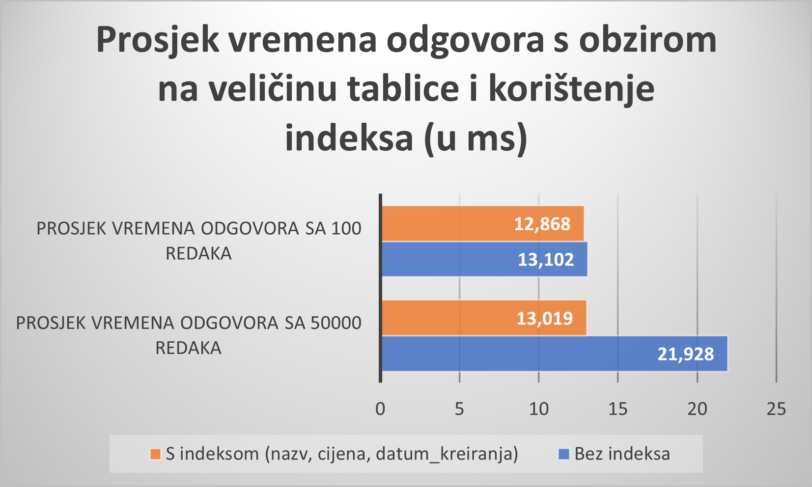
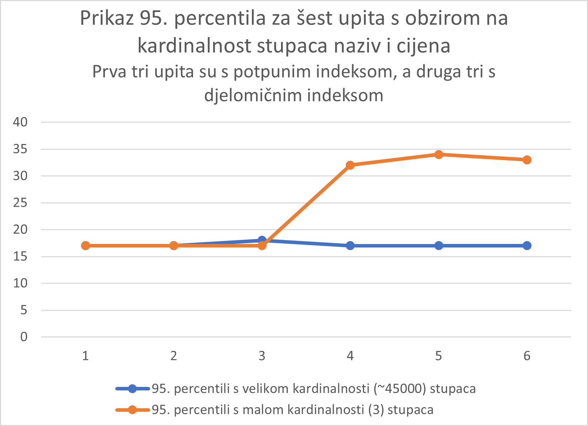
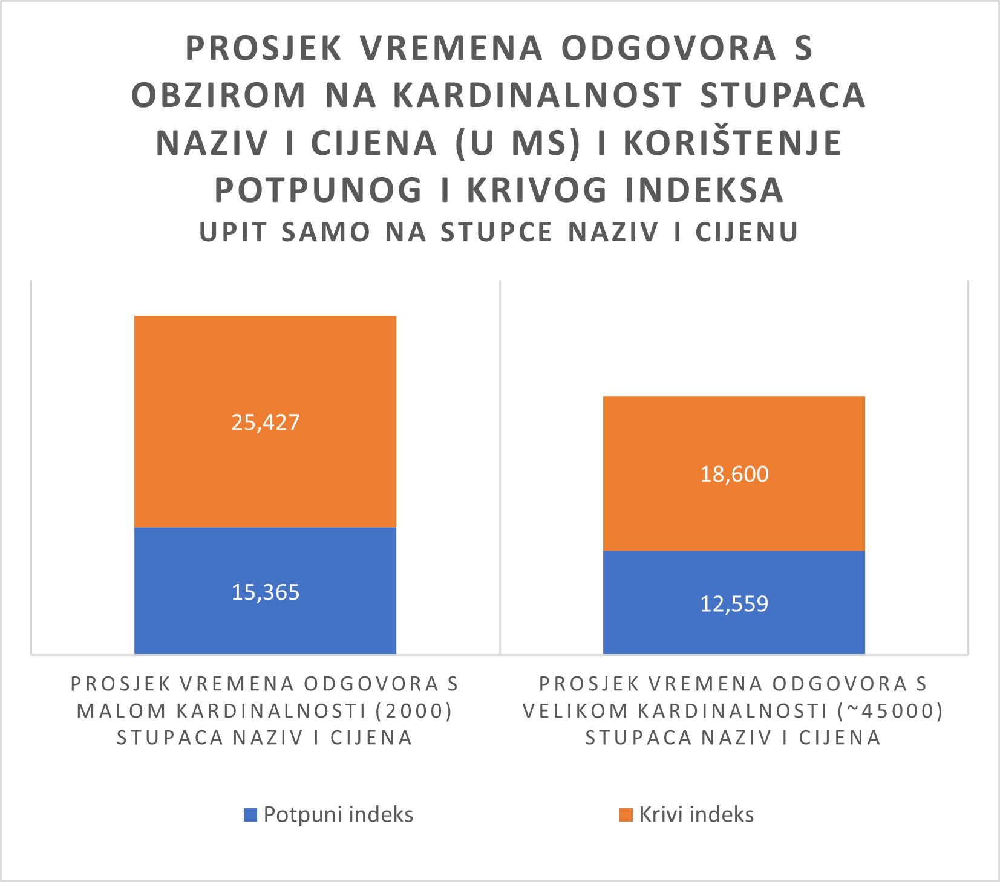
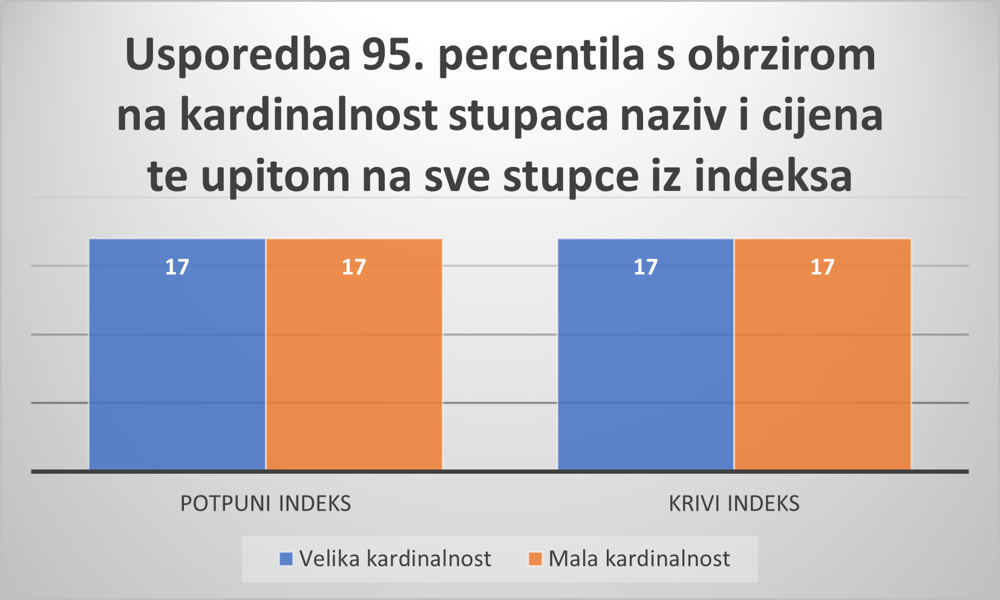

# Benchmark report - Teo Matijašić

---

## Sažetak testiranog koncepta

---

U ovom benchmarku je testiran koncept konkateniranog (složenog indeksa). To je indeks na tablici u bazi podataka koji uključuje više od jednoga stupca te služi za brže pretraživanje podataka. Time, umjesto da se kreira na jednome stupcu kao i obični indeks, konkatenirani indeks se kreira na više stupaca tablice. Time, ako bi imali tablicu sa stupcima prezime i ime te ako bi često postavljali upite koji uključuju filtriranje po tim stupcima konkatenirani indeks s tim stupcima može poboljšati efikasnost upita. Sami stupci se mogu pojaviti u bilo kojem poretku unutar indeksa, ali da bi se postigla veća efikasnost upiti moraju referencirati sve ili vodeći dio stupaca. Tako bi konkatenirani indeks s stupcima (prezime, ime) mogao efikasno pronaći rezultat upita s određenim prezimenom ili s prezimenom i imenom, ali ne i samo s imenom. Općenito pravilo je da se u konkatenirani indeks prvo stavljaju stupci kojima se najčešće pristupa.

### Kako i Zašto poboljšava sustav?

* kao i običan indeks, konkatenirani indeks služi za brzi pronalazak podataka
* poboljšava sustav jer prvenstveno služi za optimizaciju upita koji uključuju više stupaca
* zbog pohrane kombinacije stupaca, potrebno je manje čitanja na disk od traženja po cijeloj tablici

### Potencijalni problemi s konkateniranim indeksom uključuju:
* veliku ovisnost o prisutnosti određenih stupaca pa odbacivanje određenih stupaca u upitu mogu dovesti do smanjena efikasnosti
* može dovesti do opterećenja održavanja ako uključuje puno stupaca
* dovodi do sporijeg ažuriranja podataka zbog toga što se i on sam treba ažurirati kada se ovisni podaci promijene.
  
Konkatenirani indeks može pridonijeti u različitim vrstama aplikacija i slučajevima korištenja. <br>
### Neki od primjera korištenja:
* kada želimo raditi pretragu po više stupaca, na primjer u online trgovinama kada želimo filtrirati proizvode po kategoriji i cijeni.
* aplikacije za praćenje transakcija gdje možemo sortirati transakcije po datumu, količini i sl.
* aplikacije za rezervacije, pronalazak dostupnih soba/stolova prema datumu, lokaciji
* geoprostorni podaci, upiti koji uključuji i zemljopisnu širinu i dužinu

## Arhitektura sustava

---


Sam sustav sam implementirao kroz Django web aplikaciju. Kada stvorimo django web aplikaciju s naredbom:
```
django-admin startproject mysite
```
automatski s njom dolazi ugrađeni development web server te SQLite implementacija baze podataka. Unutar baze podataka, sam pomoću modela kreirao različite tablice (11 tablica, no na slici je prikazano samo 9 zbog preglednosti te nedostaju ProizvodSIndeksomDatum i ProizvodSIndeksomVelikaKardDatum) koje su predstavljale tablice s isto definiranim stupcima. Jedna od razlika među tablicama je ta što sam kreirao različite vrste indeksa nad njima što se vidi iz same slike. Osim toga tablice su imale različita svojstva ovisno o potrebnim usporedbama pa su tako neke tablice imale manji broj redaka, a druge veći broj, neke su imale velike kardinalnosti odabranih stupaca, a neke manje te su neke služile za upite samo nad pojedinim stupcima dok su druge služile za postavljanje upita nad svim stupcima. 

Same testove sam provodio slanjem ab testova na odgovarajuće URL-ove koji su pokretali određene funkcije u kojima sam implementirao da pokreću ab naredbu i ispišu njen rezultat. 
Ti ab testovi su zapravo bili slani na URL koji su pokretali poglede (views) unutar Django web aplikacije koji su bili zaduženi za postavljanje upita nad odgovarajućom tablicom unutar baze podataka. Time, ako je URL sadržavao /withoutIndex, upit se postavljao na tablicu ProizvodBezIndeksa, ako je sadržavao /withIndeks na tablicu ProizvodSIndeksom itd. Može se vidjeti i da je URL-ova više nego tablica jer su za krivi indeks kreirane dvije vrste upita, jedna sa svim stupcima iz indeksa, dok je kod drugog URL-a slan upit samo sa stupcima naziv i cijena na već postojeću tablicu s krivim indeksom.

Web Server unutar Django web aplikacije ne komunicira direktno s bazom podataka jer on služi samo za vraćanje statičnih odgovora pa je time GET (SELECT) upit (primjer dan na dnu slike) na određeni URL prvo došao do web servera (Django development server) jer je ab poslao zahtjev na njega (ab test na određeni URL) te je onda web server proslijedio do aplikacijskog servera ili same Django aplikacije gdje su se onda pregledavali URL-ovi, pozivali određeni pogledi te time i odgovarajuće tablice i tu se onda provodilo objektno-relacijsko preslikavanje (ORM). Nakon dohvaćanja podataka, postupak je išao u obrnutom redoslijedu sve dok se nije dobio odgovor, odnosno rezultat ab testa.     

Upiti na svaku tablicu su izgledali otprilike jednako te je njihov generalni pseudokod prikazan na dnu slike (Većinom su bili slani upiti na sve stupce koji su bili sadržani u indeksu, jedino se kod usporedbe dobrog i krivog indeksa slao upit na prva dva stupca, naziv i cijenu). Kod slanja određenih URL-ova, osim odgovarajuće putanje, dodani su i parametri sa znakom upitnika koji su bili odvojeni znakom & te su oni predstavljali vrijednosti stupaca (/?naziv=name&cijena=price&datum_kreiranja=date). 

## Simulacija podataka 

---

Same podatke sam simulirao pomoću factory-boy-a i Faker-a koji služe za kreiranje lažnih podataka. U sve tablice sam  točno 50000 podataka, osim kod onih s oznakom "ManjeRedaka" te sam kod njih postavio 100 podataka. Kako sam kreirao indekse nad stupcima naziv, cijena i datum_kreiranja upite sam većinom provodio nad njima. 

Kako bi usporedio i prikazao razliku i performanse pojednih vrsta konkateniranih indeksa, većinom sam uspoređivao dvije po dvije situacije od ukupno četiri.
Time sam prvo generirao jednu tablicu s normalnim indeksom gdje je bilo 100 podataka i drugu tablicu bez indeksa sa 100 podataka s istim kardinalnostima svih stupaca kako bi tablice bile jednake. Tu mi je bio cilj pokazati kako indeks nema efekta kada je u tablicama jako malo redaka. Zatim sam kreirao iste dvije tablice samo s 50000 podataka kako bi tu pokazao da kod puno podataka indeks počinje poboljšavati performanse.

Zatim, kako bi usporedio potpuni i djelomični indeks, kreirao sam tri nove tablice sa 50000 podataka. Prva je imala potpuni indeks i veliku kardinalnost stupaca naziv i cijena koji su bili sadržani u djelomičnom indeksu. Druge dvije tablice su imale djelomični indeks samo na stupcima naziv i cijena samo s drugačijim kardinalnostima stupaca naziv i cijene. Tu mi je bio cilj pokazati kako kardinalnost stupaca koji su sadržani u djelomičnom indeksu imaju utjecaja na performanse upita kada se koristi djelomični indeks s obzirom na obični indeks.

Na kraju sam, kako bi testirao potpuni i indeks u krivom redoslijedu krerirao još četiri nove tablice. Prve dvije su imale indeks nad svim stupcima u normalnom redoslijedu te veliku i malenu kardinalnost stupaca naziv i cijena nad kojima se izvodio upit. Druge dvije su imale indekse nad svim stupcima u krivom redoslijedu te velike i malene kardinalnosti stupaca naziv i cijena. Tu je bila razlika što sam postavljao upit samo nad stupcima naziv i cijena kako bi prikazao performanse upita s krivim indeksom ovisno o njihovoj kardinalnosti.

Testirao sam i vremena odgovora s ispravnim i krivim indeksom kada koristimo upit nad svim stupcima.

**Primjer generiranja lažnih podataka za jednu tablicu:**

```
class Proizvod_KriviIndeks_VelikaKard_Factory(DjangoModelFactory):
    class Meta:
        model = Proizvod_KriviIndeks_VelikaKard

    naziv = factory.Faker("word")
    opis = factory.Faker("sentence", nb_words = 10)
    cijena = factory.Faker("pydecimal", left_digits=random.choice([1, 2, 3]), right_digits=2, positive = True)
    dostupna_kolicina = factory.fuzzy.FuzzyInteger(0, 999)
    datum_kreiranja = factory.Faker('date_time')
    datum_azuriranja = factory.Faker('date_time')
```

## Mjerenja vremena odgovora

---

Za mjerenja vremena odgovora sam koristio Apache Benchmark (ab). Radi lakšeg pokretanja testova, napravio sam jednostavan GUI s gumbima koji automatski pokreću ab test te prikazuju rezultat testa. Te ab naredbe sam hard-codirao unutar koda, ali sam i napisao upute kako slati vlastite ab testove.
Što se tiče same ab naredbe, na svim testovima sam koristio istu verziju:
```
ab -n 1000 -c 3 "URL"
```
Time sam definirao da se pošalje 1000 zahtjeva te da bude razina konkurencije 3, odnosno da se šalju tri istovremena zahtjeva. Razlog zbog kojega sam slao samo 1000 zahtjeva je bio veliki broj različitih usporedbi pa bi testovi predugo trajali, a ovako se relativno mogu brzo testirati i, još bitnije, prikazati razlike. Razinu konkurencije sam postavio na 3 jer mi na početnim testiranjima, bez konkurencije nije bilo previše razlike pa sam odlučio da se šalju tri istovremena zahtjeva.
Kod rezultata sam za tri testiranja za svaku usporedbu promatrao prosjek vremena odgovora te 95. percentil kako bi potvrdio rezultate dobivene prosjekom jer oni mogu biti nepouzdani. Taj 95. Percentil je definirao da je 95% zahtjeva imalo vrijeme odgovora manje ili jednako od dobivenog praga u milisekundama.  

## Rezultati i grafovi

---

Točna vremena odgovora i percentili mogu varirati od prikazanih vremena, ali bi odnosi trebali ostati isti.

### Usporedba ne korištenja indeksa i korištenja potpunog indeksa na upite sa svim stupcima iz indeksa ovisno o veličini tablice

Rezultati je proveden slanjem tri ab testa za svaki slučaj te je onda izračunat prosjek vremena odgovora u milisekundama.
Dobiveni rezultati za prosjek vremena odgovora:
* Bez indeksa i 100 redaka:
    * prvi upit: "Time per request:       8.887 [ms] (mean)"
    * drugi upit: "Time per request:       8.423 [ms] (mean)"
    * treći upit: "Time per request:       8.763 [ms] (mean)"
    * **Prosjek:** 8.691 ms
* S indeksom i 100 redaka: 
    * prvi upit: "Time per request:       8.539 [ms] (mean)"
    * drugi upit: "Time per request:       8.776 [ms] (mean)"
    * treći upit: "Time per request:       8.634 [ms] (mean)"
    * **Prosjek:** 8.316
* Bez indeksa i 50000 redaka: 
    * prvi upit: "Time per request:       14.562 [ms] (mean)"
    * drugi upit: "Time per request:       13.796 [ms] (mean)"
    * treći upit: "Time per request:       15.970 [ms] (mean)"
    * **Prosjek:** 14.776
* S indeksom i 50000 redaka: 
    * prvi upit: "Time per request:       9.087 [ms] (mean)"
    * drugi upit: "Time per request:       8.534 [ms] (mean)"
    * treći upit: "Time per request:       8.626 [ms] (mean)"
    * **Prosjek:** 8.749
      
Veličina tablice itekako ima utjecaj na korištenje konkateniranoga indeksa. Na upit koji sadrži sve stupce iz indeksa (naziv, cijena, datum_kreiranja) te tablicu od 100 redaka, korištenje indeksa nema nikakvoga prevelikog utjecaja te tu može dovesti i do dužih vremena odgovora te nepotrebnih ažuriranja pri pisanju pa ga se u tom slučaju ne isplati koristiti. 
U slučaju kada imamo 50000 podataka indeks itekako ima utjecaja te može ubrzati pretragu za ~6ms, odnosno ~70%.



Dobiveni 95. percentili za tri upita od svakog slučaja:
* Bez indeksa i 100 redaka: (12ms, 11ms, 12ms)
* S indeksom i 100 redaka: (11ms, 12ms, 13ms)
* Bez indeksa i 50000 redaka: (17ms, 18ms, 21ms)
* S indeksom i 50000 redaka: (13ms, 11ms, 12ms)

Gledajući 95. percentil kod prva tri upita koja nisu koristila indeks, vidimo da je vrijeme odgovora za 50000 podataka veće nego kod 100 podataka. U slučaju druga tri upita gdje se koristio indeks, vidimo da je neovisno o količini podataka, vrijeme podataka otprilike isto. Time se iz grafa može zaključiti da korištenje indeksa s jako malo podataka nema nikakvoga utjecaja (narančasta linija), dok s jako puno podataka, prema 95. percentilu, indeks ubrzava pretragu za ~ 5-10 ms. 

 

### Usporedba korištenja potpunog i djelomičnog indeksa (samo naziv i cijena) na upite sa svim stupcima iz indeksa ovisno o kardinalnosti atributa sadržanih u djelomičnom indeksu

Rezultati je proveden slanjem tri ab testa za svaki slučaj te je onda izračunat prosjek vremena odgovora u milisekundama.
Dobiveni rezultati za prosjek vremena odgovora:
* Potpuni indeks i velika kardinalnost stupaca naziv i cijena:
    * prvi upit: "Time per request:       8.866 [ms] (mean)"
    * drugi upit: "Time per request:       8.857 [ms] (mean)"
    * treći upit: "Time per request:       8.638 [ms] (mean)"
    * **Prosjek:** 8.787 ms
* Djelomični indeks i velika kardinalnost stupaca naziv i cijena:
    * prvi upit: "Time per request:       8.778 [ms] (mean)"
    * drugi upit: "Time per request:       8.798 [ms] (mean)"
    * treći upit: "Time per request:       8.593 [ms] (mean)"
    * **Prosjek:** 8.723 ms
* Potpuni indeks i mala kardinalnost stupaca naziv i cijena: 
    * prvi upit: "Time per request:       8.753 [ms] (mean)"
    * drugi upit: "Time per request:       8.571 [ms] (mean)"
    * treći upit: "Time per request:       8.774 [ms] (mean)"
    * **Prosjek:** 8.699 ms
* Djelomični indeks i mala kardinalnost stupaca naziv i cijena:
    * prvi upit: "Time per request:       16.529 [ms] (mean)"
    * drugi upit: "Time per request:       16.928 [ms] (mean)"
    * treći upit: "Time per request:       16.556 [ms] (mean)"
    * **Prosjek:** 16.671 ms

Pri odabiru korištenja potpunog konkateniranog indeksa (naziv, cijena, datum_kreiranja) ili djelomičnog konkateniranog indeksa (naziv, cijena) treba uzeti u obzir kardinalnost (broj različitih vrijednosti) određenih stupaca. Ako se koristi upit koji traži sve stupce iz indeksa treba uzeti u obzir različite kardinalnosti stupaca iz djelomičnog indeksa (naziv, cijena). Time, ako imamo veliku kardinalnost (veliki broj različitih vrijednosti) tih stupaca (oko 45000 jedinstvenih kombinacija naziva i cijene), potpuni i djelomični indeks će imati jednake performanse jer će djelomični indeks uspjeti smanjiti broj redaka koje mora pretražiti na otprilike jednak broj kao i potpuni indeks. Ako se promatra mala kardinalnost tih stupaca (3, time i puno duplikata s istom kombinacijom naziva i cijene), potpuni indeks će imati jednake performanse, no djelomični indeks će biti ~ 8 ms ili 70% sporiji jer će pretraživati samo naziv i cijenu, a pošto je jako puno duplikata trebati će kroz svih njih proći i vratiti ih.


Dobiveni 95. percentili za tri upita od svakog slučaja:
* Potpuni indeks i velika kardinalnost stupaca naziv i cijena: (13ms, 12ms, 12ms)
* Djelomični indeks i velika kardinalnost stupaca naziv i cijena: (12ms, 12ms, 12ms)
* Potpuni indeks i mala kardinalnost stupaca naziv i cijena: (12ms, 12ms, 12ms)
* Djelomični indeks i mala kardinalnost stupaca naziv i cijena: (21ms, 22ms, 22ms)

Promatrajući 95. percentil, kod prva tri upita koja su koristila potpuni indeks, razlika između prosjeka vremena odgovora je skoro nikakva, dok kod druga tri upita, koja su koristila djelomični indeks, vidimo da je kod velike kardinalnosti vrijeme odgovora jednako, no kod male kardinalnosti i zbog prolaska kroz veliki broj duplikata djelomični indeks je trebao oko 10 ms više vremena da vrati odgovor.



### Usporedba korištenja potpunog i indeksa u krivom redoslijedu na upite samo s prva dva stupca iz točnog indeksa ovisno o njihovoj kardinalnosti

Rezultati je proveden slanjem tri ab testa za svaki slučaj te je onda izračunat prosjek vremena odgovora u milisekundama.
Dobiveni rezultati za prosjek vremena odgovora:
* Potpuni indeks i mala kardinalnost stupaca naziv i cijena:
    * prvi upit: "Time per request:       9.906 [ms] (mean)"
    * drugi upit: "Time per request:       10.344 [ms] (mean)"
    * treći upit: "Time per request:       9.894 [ms] (mean)"
    * **Prosjek:** 10.048 ms
* Djelomični indeks i mala kardinalnost stupaca naziv i cijena:
    * prvi upit: "Time per request:       17.677 [ms] (mean)"
    * drugi upit: "Time per request:       17.962 [ms] (mean)"
    * treći upit: "Time per request:       17.124 [ms] (mean)"
    * **Prosjek:** 17.587 ms
* Potpuni indeks i velika kardinalnost stupaca naziv i cijena: 
    * prvi upit: "Time per request:       8.250 [ms] (mean)"
    * drugi upit: "Time per request:       8.768 [ms] (mean)"
    * treći upit: "Time per request:       8.389 [ms] (mean)"
    * **Prosjek:** 8.469 ms
* Djelomični indeks i velika kardinalnost stupaca naziv i cijena:
    * prvi upit: "Time per request:       13.543 [ms] (mean)"
    * drugi upit: "Time per request:       12.680 [ms] (mean)"
    * treći upit: "Time per request:       12.776 [ms] (mean)"
    * **Prosjek:** 12.999 ms



Dobiveni 95. percentili za tri upita od svakog slučaja:
* Potpuni indeks i mala kardinalnost stupaca naziv i cijena: (12ms, 14ms, 12ms)
* Djelomični indeks i mala kardinalnost stupaca naziv i cijena: (20ms, 21ms, 20ms)
* Potpuni indeks i velika kardinalnost stupaca naziv i cijena: (11ms, 12ms, 12ms)
* Djelomični indeks i velika kardinalnost stupaca naziv i cijena: (16ms, 17ms, 17ms)

Promatrajući 


### Usporedba korištenja potpunog i indeksa u krivom redoslijedu na upite sa svim stupcima iz indeksa

Rezultati je proveden slanjem jednog ab testa za svaki slučaj.

Dobiveni 95. percentili za svaki od upita:
* Potpuni indeks i velika kardinalnost stupaca naziv i cijena: 12ms
* Djelomični indeks i velika kardinalnost stupaca naziv i cijena: 12ms
* Potpuni indeks i mala kardinalnost stupaca naziv i cijena: 11ms
* Djelomični indeks i mala kardinalnost stupaca naziv i cijena: 11ms


